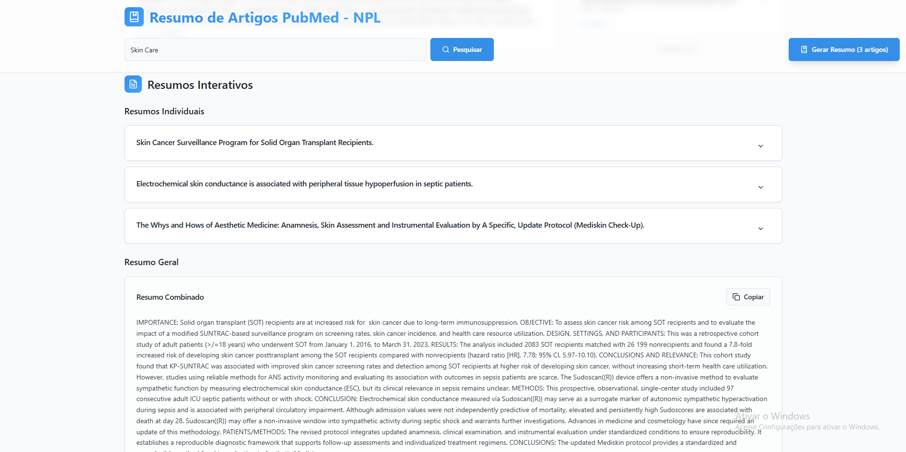

# PubMed Article Analyzer - NPL




### Sobre o projeto
O PubMed Article Analyzer - NPL é uma aplicação web que permite buscar, selecionar e gerar resumos de artigos científicos diretamente do PubMed. Utilizando a API de NLP personalizada, a aplicação processa os artigos selecionados e fornece resumos concisos e análises adicionais, ajudando pesquisadores e estudantes a economizar tempo na revisão de literatura.

### Funcionalidades
- Buscar artigos por palavras-chave, autores ou termos médicos.
- Visualizar resultados com título, autores, data e resumo dos artigos.
- Salvar artigos na lista pessoal para revisão posterior.
- Gerar resumos via API de NLP personalizada.
- Feedback visual com mensagens de sucesso ou erro.
- Layout responsivo, adaptado para desktop e dispositivos móveis.
- Tecnologias utilizadas
- API de NLP: API PubMed NLP
- Integração PubMed: E-Utilities API
- Gerenciamento de estado: React Hooks personalizados

## Requisitos

- [Node.js](https://nodejs.org/en/) (v21 ou superior recomendado)
- [npm](https://www.npmjs.com/) ou [yarn](https://yarnpkg.com/)
- Backend da API de NLP: [api-pubmed-nlp](https://github.com/AndersonAlvesCoelho/api-pubmed-nlp)

## Instalação

### 1. Clonar repositórios

**Frontend:**
```bash
git clone https://github.com/AndersonAlvesCoelho/pubmed-analyzer.git
cd pubmed-analyzer
```
